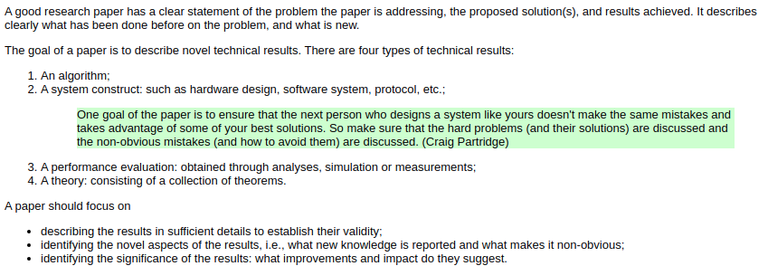
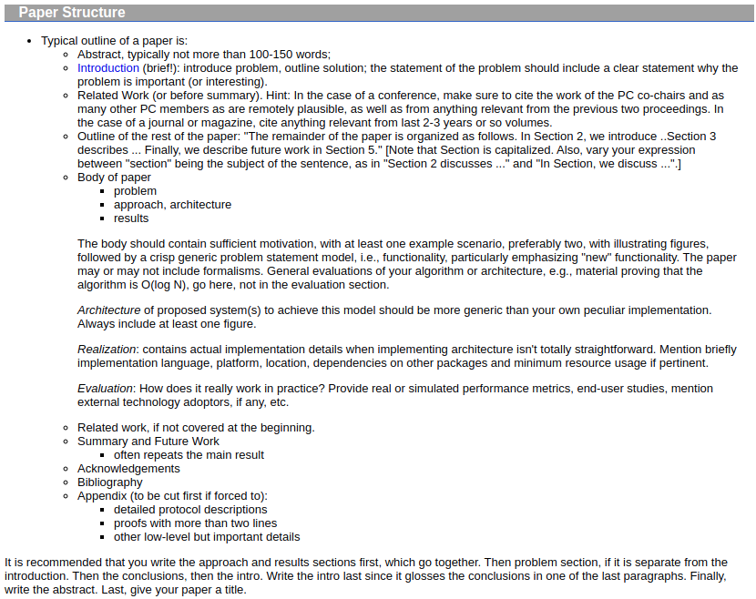

-
- **Título**: Writing Technical Articles
- **Metadata**:
	- **Autor**:  [[Schulzrinne, Henning]]
	- **Revista**:
	- **Idioma**: [[Inglés]]
	- **Año**: 2021
	- **Tipo**: #web
	- **Categorías**: [[Read]], [[Research]], [[Técnicas de estudio]]
	- **Enlace**: https://www.cs.columbia.edu/~hgs/etc/writing-style.html
	- **Contenido**:
		- **Resumen**: The notes below apply to technical papers in computer science and electrical engineering, with emphasis on papers in systems and networks.
		  
		  Read Strunk and White, Elements of Style. Again.
		  
		  Give the paper to somebody else to read. If you can, find two people: one person familiar with the technical matter, another only generally familiar with the area.
		  
		  Papers can be divided roughly into two categories, namely original research papers and survey papers. There are papers that combine the two elements, but most publication venues either only accept one or the other type or require the author to identify whether the paper should be evaluated as a research contribution or a survey paper. (Most research papers contain a "related work" section that can be considered a survey, but it is usually brief compared to the rest of the paper and only addresses a much narrower slice of the field.)
- **Notas:**
	- 
	- 
	- **Sobre el título:**
		- Evite todas las abreviaciones, excepto las fáciles de entender.
		- Evite frases como "novel", "performance evaluation" y "architecture", ya que casi cada paper realiza cada una de ellas. Nadie busca estas en  Google.
		- Use adjetivos que describan las características de su trabajo, por ejemplo: "reliable, scalable, high-performance, robust, low-complexity, or low-cost". Trate de ser específico, cuando su paper sea una "perfomance evaluation", para evitar esa frase, puede usar alternativas como: "Delay measurements of X" or "The quality of service for FedEx deliveries".
	- **Sobre el resumen:**
		- Evite usar frases redundantes como "In this paper".
		- Evite motivaciones generales.
		- No solo remarqué el problema, sino los principales resultados. Esto puede hacer decidir al lector si leer o no su paper.
		- Añada los términos que identifican su trabajo, para hacer más fácil la búsqueda en los motores de búsqueda.
		- Evite ecuaciones.
		- **Sobre la introducción:**
-