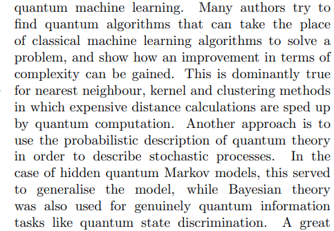

- ## Paper
  background-color:: #49767b
	- ## Metadata
	  Title:: An introduction to quantum machine learning
	  Author:: [[Schuld, M]], [[Sinayskiy, I]], [[Petruccione, F]]
	  Journal::
	  Language:: [[Inglés]] 
	  Type:: [[Paper]]
	  Keywords:: [[Quantum machine learning]], [[Quantum computing]], [[Machine Learning]]
	  Year:: 2014
	  Status::
	  Start::
	  End::
	  Link:: https://paperpile.com/app/p/2d141a6a-0587-06bd-9dd4-787c6015b052
	- ## Abstract
	- Machine learning algorithms learn a desired input-output relation from examples in order to interpret new inputs. This is important for tasks such as image and speech recognition or strategy optimisation, with growing applications in the IT industry. In the last couple of years, researchers investigated if quantum computing can help to improve classical machine learning algorithms. Ideas range from running computationally costly algorithms or their subroutines efficiently on a quantum computer to the translation of stochastic methods into the language of quantum theory. This contribution gives a systematic overview of the emerging field of quantum machine learning. It presents the approaches as well as technical details in an accessable way, and discusses the potential of a future theory of quantum learning.
	- ## Notes
	- Introducción
		- 
	- 2.2 QML
		- Las operaciones se pueden hacer al mismo tiempo, es decir, tiene un paralelismo «libre» o «sin restricciones».
		- 
	- Conclusión
		- Existen dos enfoques de QML:
			-  