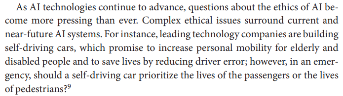

- ## Book
  background-color:: #49767b
	- ## Metadata
	  Title:: 
	  Author:: [[Matthew Liao, S]]
	  Edition:: 1
	  Cover::
	  Journal::
	  Language::
	  Type:: [[Book]]
	  Keywords:: [[Artificial Intelligence]], [[Ethic]], [[Philosophy]]
	  Year:: 2020
	  Status::
	  Start::
	  End::
	  Link:: https://paperpile.com/app/p/d089633a-316f-061b-9037-c9c2846002e9
	- ## Notes
	- Cap: _A Short Introduction to the Ethics of Artificial Intelligence_
		- Hay sistemas de AI que puede pintar como van Gogh, escribir música como los Beatles, escribir su propio lenguaje de criptografía, identificar tejidos de cancer.
		-  
			- ¿Falso dilema?
		- 
		- En la actualidad existe la especifica IA (_narrow AI_) que significa que en la actualidad solo se desarrollan sistemas de IA para tareas específicas; aún no hemos llegado a las IA general (AGI) que sería capaz de realizar cualquier tarea que un humano pueda hacer. A esta última también se le conoce como IA fuerte (strong AI).
			- La especulación dice que si esos sistemas llegaran a existir podrían **automejorarse** y desarrollar la _explosión de inteligencia_ o  _singularidad_, que excedería la capacidad humana.
			- 
		- Se distinguen dos IA:
			- Vulnerabilidades ML: Limitaciones actuales de los sistemas ML.
				- ML necesita muchos datos.
				- Un sistema de ML es tan bueno como los datos de los cuales aprende. Si los datos son malos, el modelo también lo será.
				- Incluso con datos buenos, si se selecciona un algoritmo incorrecto, entonces, el modelo no hará buenas predicciones: creando el sobreajuste o infrautilización.
					- 
				- DL es una caja negra que plantea cuestiones como la interpretabilidad, explicabilidad y confianza en lo que se está haciendo.
					- 
					- Existen algunos intentos para lograr una mayor interpretabilidad:
						- 
					- ¿Cómo se puede atacar a un sistema de DL?
						- 
					- ML es una IA débil. No tienen conciencia  y ellos no puede pensar por sí mismos. Ellos no entiende realmente las características del mundo tales como la relaciones causales.
						- 
						- 
						- 
						- También está el problema en los coches autónomos, ¿se debe siempre privilegiar a los pasajeros?
						-
			- Vulnerabilidades humanas: El sistema ML puede trabajar tan bien que el humano es vulnerable al trabajar o interactuar con este sistema.
				- El reconocimiento facial tiene una gran exactitud dentro de una multitud.
				- Videos tan realistas que no se puede decir si son falso (Deepfakes).
				- La automatización de los robots. Ellos no necesitan dormir, puede ser duplicados y reemplazados.
				-
		- _Key Concepts in Machine Learning_:
			- Stuart Russell y Peter Norvig propusieron cuatro manera de definir la IA:
				- 1. Actuar humanamente.
				  2. Pensar humanamente.
				  3. pensar racionalmente.
				  4. actuar racionalmente.
					- Los sistemas de IA requieren hacer funciones cognitivas: pensar, aprender y resolver-problemas.
					- 
						- Una forma de IA es la simbólica. Dominada por los sistemas expertos. No sabía que un sistema experto se puede modelar a través de grafos dentro de una base de datos. Bueno ahora que lo pienso, no es raro.
					- Otra forma es ML.
					- Y la actual y más popular es DL. Que comenzó a ser útil gracias al poder de cómputo y almacenamiento, y al trabajo en nuevos tipos de redes neuronales propuestas por Geoffrey Hinton, Yann LeCun y Yoshua Bengio.
						- 
							- DL usa las capas de nodos para detectar, ajustar las características de un conjunto de datos en pos de minimizar la perdida en precisión (accuracy). Para hacer esto hace uso de la técnica back-propagation, el cual obtiene el error entre el valor esperado y el valor actual, y ajusta los pesos en la dirección (nodos) de menor errores. Al hacer esto, toda la red se propaga para predecir mejores respuestas.
							-
					- Hay diferentes tipos de redes neuronales, por ejemplo, las recurrentes  (RNNs), las cuales tiene un tipo de memoria que es útil para resolver problemas con datos temporales como la predicción de secuencia de palabras. Otra son las convoluciones (CNNs), las cuales son buenas para reconocer patrones a través del espacio, en particular buenos para clasificación de imágenes y tareas de visión por computadora.
				- Vulnerabilidades en ML