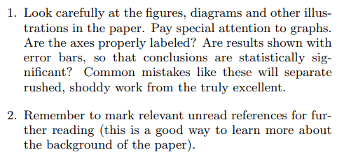

- ## Paper
  background-color:: #49767b
	- ## Metadata
	  Title:: How to Read a Paper
	  Author:: [[Keshav, S. ]]
	  Journal::
	  Language:: [[Inglés]]
	  Type::  [[Paper]]
	  Keywords::
	  Year::
	  Status::
	  Start::
	  End::
	  Link:: https://paperpile.com/app/p/b7772a0a-eacf-0047-b29f-c8777a7b00fd
	- ## Abstract
		- Researchers spend a great deal of time reading research papers. However, this skill is rarely taught, leading to much wasted effort. This article outlines a practical and efficient three-pass method for reading research papers. I also describe how to use this method to do a literature survey.
	- ## Notes
		- El método descrito para leer efectivamente paper se basa en tres pasos:
			- 1. El primer paso es tener una idea general del paper. Hay que hacer una vista rápida al paper, aquí tú decides si necesitas continuar a los siguientes pasos. Esto podría tardar entre 5-10 minutos.
				-  
				-  
				- Una vez realizados estos tres sub pasos del paso uno, entonces debes preguntarte lo siguiente:
					-  
					- Teniendo estas cinco C en cuenta puede decidir si leer o no el paper.
			- 2\. Te adentras en el contenido, pero no en los detalles. Ahora debes leer el paper con más cuidado, pero ignorando detalles como las demostraciones matemáticas (en mi caso sería: algoritmos). Es buena idea comentar en los márgenes según lo que vas leyendo.
				-  
				- Este paso puede tomar una hora (dependiendo del paper, claro). Se debería resumir los principales puntos.
				- Hay ocasiones que incluso al final de este paso (segundo) no entiendes totalmente el paper. Puedes ocurrir porque el tema es nuevo para ti, o el autor puede usar alguna demostración o algoritmo que no entiendes, también el paper puede estar mal escrito, o solo estás trabajando de noche y estás cansado.Hay tres opciones para tratar con esto:
					- 1. Dejar el paper a un lado y esperar no necesitarlo en un futuro.
					  2. volver al paper al otro día, quizás leyendo otros papers.
					  3. perseverar e ir al punto 3.
				- 3\. Te ayuda a entender el paper en profundidad. Sobre todo si eres un revisor. La clave de esta fase en virtualmente reimplementar el paper. Intentar recrear el trabajo de los autores. Con esto puedes identificar las innovaciones el paper, si no también, algunos errores o falsas afirmaciones.
					- Este paso requiere gran atención en los detalles. Se debería anotar cada afirmación que dan los autores para buscar que no existen contradicciones.
					- Podría en este paso encontrar nuevas ideas para futuros trabajos.
					- Puede encontrar puntos fuertes y débiles.
					- Lo siguiente es hacer una revisión de la literatura (tres pasos):
						-  
						-  
						-  
			- 
			- Referencias:
				- [1] S. Peyton Jones, “Research Skills,”
				  http://research.microsoft.com/ simonpj/Papers/givinga-talk/giving-a-talk.htm.
				  [2] T. Roscoe, “Writing Reviews for Systems
				  Conferences,”
				  http://people.inf.ethz.ch/troscoe/pubs/reviewwriting.pdf.
				  [3] H. Schulzrinne, “Writing Technical Articles,”
				  https://www.cs.columbia.edu/~hgs/etc/writing-style.html
					- [4] G.M. Whitesides, “Whitesides’ Group: Writing a
					  Paper,”
					  http://www.che.iitm.ac.in/misc/dd/writepaper.pdf
					  [5] ACM SIGCOMM Computer Communication Review
					  Online, http://www.sigcomm.org/ccr/drupal/.
-