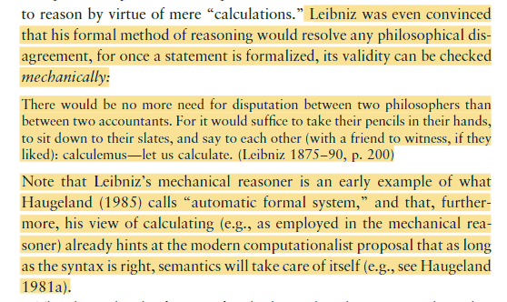

- ¿Qué es el computacionalismo?
	- Teoria computacional de la mente.
	- Cognitivas:
	- operaciones (input/output) y representaciones (transformaciones)
	-
	- Significa que las capacidad cognitivas (memoria, atención, comprensión, lenguaje, razonamiento) son computación: , por ejemplo aprender un lenguaje.
	- Ejemplo: Descargar la mente e instalarla en un computador, inmortalidad.
		-
	- Mecanicismo. Siglo 17. Leibniz, Descartes. No es algo nuevo.
		- Copeland mostro que partes del cuerpo pueden ser análogas a las partes mecánicas de una máquina. Lo mismo presentaba Descartes.
		- 
		-
	- El problema de la semántica. Teoría de la información de Shannon solo es estadística no dice nada del aspecto semántico.
		- Ejemplo de Barbara, 1 o 0, si o no, vamos a tal lugar.
	- MARCIN MIŁKOWSKI Objeciones:
		- Relacionadas con la natural de la computación. El cerebro no es digital.
		- Relacionadas con la semántica. La habitación china de Searle.
			-
		- Relacionadas contra funcionalismo computacional.  El sentido común no puede formalizado.
	-
-